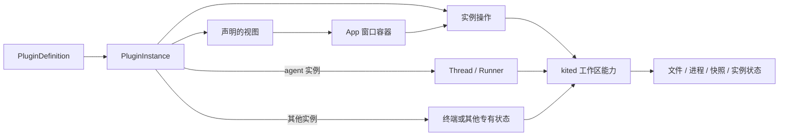

# Agent 与插件契约

日期：2026-09-30。

本文记录实施前选定的架构方向：agent 是一种插件，和其他插件共用定义、实例、操作与窗口契约；Thread 保留 agent 专有的会话与执行数据。自定义插件需要能编写界面和逻辑，并调用工作区能力。工作区统一管理窗口集合，添加和关闭跨端同步，布局与焦点由各设备分别管理。

以下接口是目标设计，尚未全部实现；字段和实现技术仍可在实施时收敛。当前进度见第 2 节。会话状态以 `harness/types.ts`、`transcript.ts` 和 [会话状态机](会话状态机.md) 为准。

## 1. 统一边界

统一到插件实例这一层：

| 边界 | 设计 | 理由 |
| --- | --- | --- |
| 定义和实例 | agent、终端、待办等均由 PluginDefinition 创建 PluginInstance | 身份、归属、配置和持久生命周期只保存一份 |
| 操作 | 插件登记有类型的操作，按实例调用 | 界面按钮与模型工具可以复用同一业务动作 |
| 实际执行 | agent 实例使用 Thread / Runner；其他实例保留自己的业务状态与执行入口 | 对话回合、PTY、待办的状态不同 |
| 窗口 | 统一引用 instanceId + viewId，共用容器和布局 | 窗口无需按 agent 和普通插件分成两种对象 |
| 工作区能力 | 共用文件、进程、快照、线程等服务契约 | 用户操作与模型调用应经过同一组核心语义 |
| 内置与自定义插件 | 共用公开声明和能力契约，允许不同实现入口 | 内置文件和终端可以保留原生界面，自定义界面可以用 Web |
| 上下文 | 复用现有场景、ContextDefinition 和 ContextBinding | 编辑器和模型实际请求应使用同一份定义和快照 |

例如，同一个包可以登记待办插件定义和整理待办的 agent 插件定义。待办实例持有任务数据、看板和列表视图；agent 实例持有一个 Thread，通过授权后的待办操作整理任务。两者都是 PluginInstance，有各自的业务数据。

不增加 Agent 持久表。`AgentDefinition` 是插件定义中的 agent 配置；`PluginInstance` 是工作区中的对象身份；Thread 是 agent 实例专有的数据；Runner 驱动该 Thread。统一实例不要求待办或终端使用会话回合状态机。

## 2. 当前实现与后续边界

已接通 Project → Checkout → Workspace → PluginInstance，agent 与文件、终端、预览使用同一实例身份和窗口机制：

- 共有身份、工作区、定义引用、标题、配置、呈现偏好和持久生命周期由 PluginInstance 保存；Thread 表只保存 instanceId、runtime、nativeId。
- 工作区聚合分别返回 instances、threads、windows。执行服务需要的 ThreadContext 是联表投影，不是另一份可变身份。
- WindowTarget 统一为 instanceId + viewId。宿主核对实例归属、生命周期及定义声明；同一目标最多一个打开窗口，不同视图可以各有窗口。
- 创建 agent 实例、Thread 和可选首窗口在同一 SQLite 事务中完成。关闭窗口保留实例和执行；归档 agent 同时关闭其窗口。
- 窗口操作有持久收据，包括打开已有窗口；关闭后迟到重试不会复活窗口。共享集合由 kited 保存，各端按窗口 ID 保存自己的布局。
- `plugins.ts` 登记内置 coding、只读 review、文件、终端；App 从 `/plugin-definitions` 读取可创建对象与视图。文件实例在同一个窗口提供目录、文本、Markdown 预览与历史 diff，终端仍是占位。

harness 的 AgentDefinition 已接模型、工具选择、上下文与请求预算，并绑定到实例。配置修改与对应通知同事务保存，在下一自然请求边界纳入；基础指令保持固定，上下文变化追加到历史，配置和工具声明保存为请求快照。完整投递语义见 [线程通知投递](线程通知投递.md)。Claude 入口保留原执行服务，尚未接这套可编辑配置。

agent.start / list / send / resume / stop 已通过类型契约接入 HTTP 与 harness 工具；宿主绑定调用方，核验工作区与实例授权，停止沿用 Thread 收据。创建可省略窗口或首条消息，查询不打开 Runner。授权默认限于自己创建的 agent，撤回授权在执行入口立即核验。完整接口、重试与取消规则见 [实例操作与授权](实例操作.md)。共享工作区并发及配置编辑界面仍待实现；Bun 自定义插件的包登记、执行、能力桥及模型工具登记已接通。

文件插件作为首个真实系统插件，声明 files.list / read / diff / state / select。目录与文本读取复用 agent 的 `WorkspaceFiles` 服务；所选文件及可选历史 diffId 保存于实例 state，两端共享，浏览目录、行号定位与文本页码由设备管理。文件操作供 UI 与已授权的插件使用，模型沿用 read / patch / shell。当前提供只读文本、Markdown 预览与历史 diff，文件内容变化由用户刷新，未接文件监听或编辑器。

自定义插件的承载与执行边界已有独立的[短验证](../spikes/plugin-boundary/README.md)：待办逻辑通过 MCP 在受限 Deno 进程中运行，Web 视图通过 MCP Apps 连接 WKWebView 宿主；持久状态由宿主保存，工作区读取复用现有实例授权。实验还未接入正式插件目录、动态模型工具或 App 窗口，不能把实验跑通等同于自定义插件已可安装使用。

2026-09-30 用户决定优先建设插件与 harness 共用的操作系统沙箱。正式自定义插件逻辑继续使用 Bun，Deno 实验保留原样作为历史验证。共享适配层已接 harness shell 和 Bun 插件进程，宿主 read / patch 也检查执行策略。插件包登记、状态、工具收据与实例授权桥见 [Bun 插件宿主](Bun插件.md)。具体边界见第 7 节。

在研阶段直接修改模型和协议，不为旧窗口目标或重复字段增加兼容层。定义内容摘要用于复现当时的执行配置。

## 3. 定义、实例、专有数据与窗口

### 3.1 PluginDefinition 与 manifest：可以创建什么

PluginDefinition 描述一类可实例化的插件；manifest 是它的登记格式。一个包可以登记多个定义，共用发布版本。定义声明：

- 稳定 ID、名称、内容版本；
- 提供的视图、操作、上下文来源，以及可选的 AgentDefinition 配置；
- 自定义界面入口、工作机逻辑入口；两者均可缺省；
- 配置的数据结构；
- 请求使用的工作区能力，以及需要访问的网络目标；
- 实例数量约定：每工作区一个，或允许多个；
- 视图 ID、默认视图和窗口数量约定。

agent 定义可以直接使用内置 Runner，无需额外插件进程；待办定义使用自己的状态与操作，无需 Thread。manifest 描述提供和请求的能力，宿主决定实际授权。

内置插件也登记在同一个目录中。内置身份由宿主注册，不能通过自定义 manifest 写一个 `system: true` 获得。

### 3.2 AgentDefinition：agent 插件的专有配置

定义包含上下文场景与定义引用、模型设置、允许使用的工具、输出约定、预算，以及默认呈现和工作区策略。

引用工具时只选择宿主已注册的能力，不复制它们的实现。模型实际收到的工具，是定义选择、当前工作区授权和已连接能力的交集。上下文文字不能提升工具权限。

定义引用和实例配置由 PluginInstance 保存。恢复同一个 agent 实例时沿用其已绑定配置；显式更换配置在下一个请求边界生效并留下记录。配置变更与工作区状态通知共用投递路径，普通通知不独自唤醒线程。首次指令固定，后续上下文变化追加到历史；journal 保存本次纳入的通知及配置快照引用，请求快照保存实际设置和上下文定义和值。这些历史快照不成为另一份可变配置源。

触发器单独声明“哪个事件触发哪种工作”，不塞入上下文组装器。`agent.start / list` 适配实例创建与查询，`agent.send / resume / stop` 是针对 agent 实例的操作，最终调用现有 Thread 服务。

### 3.3 PluginInstance：某工作区里的一份插件业务状态

例如一个编程 agent、一个终端、一份待办看板，或一套预览配置。共有字段包括稳定实例 ID、工作区归属、定义引用、标题、配置与持久生命周期。Thread 不再重复拥有这些字段。进程句柄和 Runner 属于运行时信息。

| 插件实例 | 专有数据或资源 | 操作示例 | 视图示例 |
| --- | --- | --- | --- |
| 编程 agent | 一个 Thread、journal、执行与恢复状态 | send、resume、stop | conversation |
| 终端 | PTY、进程与终端状态 | write、resize、terminate | terminal |
| 待办 | 任务与排序 | add、complete | board、list |

每个 agent 实例对应一个 Thread；同一 agent 定义可以创建多个实例。目标存储可让 Thread 以 instanceId 作为主键及外键，仅保存 runtime、nativeId 等专有字段；不另造一个对外 agentId。原生运行时 ID 与实例 ID 分开。窗口 ID 也独立存在。

共有身份与 agent 专有记录应在同一次创建或删除中保持一致，不能出现有实例却没有 Thread 的半成品。具体数据库结构在实施时确定。业务状态使用各自的有类型结构，不把 journal 或 PTY 句柄塞进通用 JSON 来追求一致格式。

窗口关闭后仍可能需要它：agent 可以调用待办工具，终端进程可能还在运行。后台能力由工作机管理，不能依赖某台 iPhone 保持前台。

插件状态留在自己的命名空间。实例之间通过结构化操作、查询或上下文绑定交换数据。插件创建 agent 实例时记录来源实例和来源回合；来源关系不自动构成删除关系。

### 3.4 WorkspaceWindow：插件实例的一种呈现

工作区的窗口记录由 kited 管理，两端引用同一个窗口 ID。建议至少包含以下信息，字段名暂定：

```ts
interface WindowTarget {
  instanceId: string;
  viewId: string;
}

interface WorkspaceWindow {
  id: string;
  workspaceId: string;
  target: WindowTarget;
}
```

宿主校验实例属于当前工作区，且 viewId 已由该实例的定义声明。同一个 `instanceId + viewId` 默认只有一个打开的窗口，再次打开时聚焦原窗口；不同 viewId 可以对应多个窗口。视图内部的临时选择不作为实例身份。

agent 默认只提供 conversation 视图，因此一个 Thread 对应 0 或 1 个独立会话窗口；inline 或 background 呈现可以不创建独立窗口。其他插件按声明提供 0 到多个视图。以后 agent 增加专用视图也使用同一套窗口机制。创建新实例和打开已有实例的视图是两个明确动作。

窗口容器统一负责 header、缩小、展开、关闭、焦点、尺寸和停靠。内容可以是原生对话、原生文件视图或插件 Web 界面。自定义界面无需重做 Mac 标题栏和 iPhone 的窗口切换。

会话窗口的 header 当前固定显示“代理”，不显示工作区标题或项目信息。实例标题仍可用于实例列表；工作区名称与项目关系属于导航层。

**已确认的同步边界：** 同一工作区在 Mac 和 iPhone 上拥有同一组窗口。窗口集合、稳定 ID 和目标引用保存在 kited；添加或关闭窗口同步到各端。实例与专有业务数据也保存在工作机，关闭窗口保留绑定实例及其数据。

分栏、尺寸、停靠顺序、当前展开项与焦点由各设备分别保存，按 machineId / workspaceId 分组。缩小和展开只改变当前设备的呈现。iPhone 切换窗口不会改变 Mac 的分栏和展开状态。重连时以服务端窗口集合为准，再应用本机布局；已经关闭的窗口不会因旧的本机布局重新出现。

## 4. 内置与自定义插件的契约

把“来源、实现方式、权限”分别表达：

| 项目 | 内置 agent / 文件 / 终端 | 自定义插件 |
| --- | --- | --- |
| 定义登记、实例身份 | 公共格式 | 公共格式 |
| 窗口容器和操作 | 公共格式 | 公共格式 |
| 工作区服务 | 文件、进程、快照等公共能力 | 已授权的同名能力 |
| UI 实现 | 可使用原生 SwiftUI | 建议 HTML / CSS / JS |
| 工作机逻辑 | 内置服务适配器 | 插件执行入口或外部服务适配器 |
| 私有核心能力 | 宿主内部按实现需要使用 | 不进入公开插件接口 |

例如 TerminalPlugin 提供窗口和终端业务操作，PTY 的创建、信号、进程组和清理由核心 TerminalService 提供。agent 的 shell 也调用核心进程服务，但批处理 shell 与交互 PTY 保留各自参数和生命周期，不能因为共用服务而强行变成同一种任务。

AgentPlugin 同样通过 Thread 服务提供 send、resume、stop 等操作。内置适配器可以直接调用核心服务，无需为了格式一致增加进程间通信；UI 和其他插件通过公开操作调用，不能直接修改数据库或 Runner 私有字段。

## 5. 契约分成五份

### 5.1 声明契约

manifest 负责发现定义、配置校验和入口登记。UI 与工具共享同一个实例的身份。插件包加载失败不影响工作区及其他插件。

### 5.2 工作区能力契约

先从已有需求提取少量服务：

- 文件：列出、读取、按版本写入或 patch、变化通知；
- 进程：执行任务、创建 PTY、输入输出、调整尺寸、停止和查询；
- 版本：读取 diff、快照与检查结果，执行已开放的工作区操作；
- 实例：创建、查询、打开视图与调用已授权操作；agent 的发送、停止、继续和确认恢复通过 agent 插件适配现有线程服务；
- 存储：插件实例的结构化配置和状态。

UI 的按钮和模型的工具调用可映射到同一个服务操作。两者允许使用的操作分别声明：界面内部的排序、分页等无需出现在模型工具列表里。

调用身份由宿主绑定，包含工作区、调用方实例和允许的目标。不能靠插件自己传来的 workspaceId、instanceId 或路径认定权限。模型供应商凭据只留在宿主；插件通过已授权的实例创建与 agent 操作调用模型能力。

### 5.3 操作契约

每个操作有确定的输入和输出 schema、允许的调用方、只读或修改语义，以及取消后的结果。

操作由插件定义登记，实例操作以 instanceId 定位。例如：

```text
agent.stop { instanceId, operationId }

界面停止按钮 / 另一个 agent 的工具调用
→ 宿主校验操作 schema、工作区、目标实例与授权
→ agent 插件的 stop 操作
→ Thread 服务 interrupt({ id: operationId })
→ 返回现有停止收据与执行状态
```

App 的未确认输入继续按现有停止请求传递；适配器不能丢弃它们，也不能重复退回草稿。获得授权的插件可以调用另一个 agent 实例；自定义插件请求 `agent.stop` 不意味着它默认可以停止工作区内的所有 agent。

定义分别声明供界面、模型或内部逻辑调用的操作。同一个动作可以同时开放给 UI 和模型，也可以只供 UI 使用。模型仍接收明确的工具名与 schema，例如 agent.stop、todo.complete；公共调用层不把它们压成一个无类型的万能 invoke 工具。

有副作用的操作使用稳定 operationId 处理重试；状态修改可以携带 expectedRevision 防止覆盖较新的内容。拒绝、业务失败、取消和结果未知应可区分。任意进程在崩溃后的结果仍可能未知，不能通过自动重试伪装成恰好执行一次。

取消请求只表示要求停止，资源是否已停止由服务确认。这与当前 Thread 停止契约一致。停止 Thread 继续沿用其现有停止收据，不能再包一层会重复退回草稿的通用 stop 实现。

工具并发能力由服务确认。插件写 `parallel: true` 不能绕过工作区的写入、快照和进程调度边界；现有每 Runner 的工具调度也不等于跨 Thread 的共享文件安全。

### 5.4 状态与事件契约

统一事件外层的对象引用、工作区归属、游标和因果来源；payload 保留各领域自己的类型。

客户端与插件先读快照，再接后续通知。先复用现有 SSE 的进程 epoch / cursor 和重连完整快照规则。订阅建立期间的事件不能漏掉；断线与重连也不能被当成业务已停止。

通知不保证只到一次。需要可靠触发的任务必须带持久去重依据；一般界面订阅不必因此升级成全局事件日志。

只订阅有权访问的对象和事件。默认读取状态不会唤醒 agent；真正自动执行的行为由触发器负责。插件不能监听原始 journal 来推测所有私有执行细节。

### 5.5 上下文契约

复用 `contextScenes`、`ContextDefinition`、`ContextBinding` 和请求快照：

1. 插件可以登记有名称、来源和取值规则的上下文提供者；
2. 宿主在相应业务场景中决定哪些变量可用；
3. agent 定义选择需要的变量和工具；
4. 宿主在请求边界取值，组装器只校验和展开；
5. 当次值、来源、定义一起保存，历史不重新读取插件的最新状态。

插件状态可丰富为结构化数据；进入现有组装器时投影成 ContextBinding，不另造模板语言。完整 diff、日志等大内容通过工具按需读取。插件的界面焦点、选择区等只能作为明示来源的材料，不能悄悄覆盖 agent 的基础指令。

通知正文也使用这份契约。配置变更与基础上下文更新各有场景和变量，通知携带完整组装快照，模型正文及历史预览从同一快照还原。投递层负责目标、顺序和时机，模型适配器只负责协议转换；正文模板不能改变宿主确定的权限与执行配置。

## 6. 跟进会话状态重构

已从当前代码核对的新边界：

| 事实 | 所属层 |
| --- | --- |
| `open / archived` | PluginInstance 保存持久生命周期；ThreadContext 联表读取 |
| `idle / running / stopping / finishing` | Thread 当前执行阶段 |
| `completed / interrupted / failed` | 上一回合结果 |
| `waitingForResume` | 等待显式推进 |
| `recovery` | 恢复阻塞及原因 |
| `open / closing / closed` | Runner 实例生命周期 |
| send / interrupt / resume / cancel 能否执行 | 服务端 capabilities；插件授权再限定调用方能否使用 |
| 窗口集合、添加和关闭 | kited 管理的工作区窗口状态，跨端同步 |
| 窗口展开、停靠、分栏和焦点 | 各客户端的呈现状态 |

手动停止冻结队列并退回尚未纳入请求的输入；停止 id 的收据负责重试。普通失败目前保留队列、等待显式继续。插件和 agent 协作工具应调用这些现有操作，不用 `phase == idle` 自行判断是否可以执行，尤其不能忽略 recovery。

统一实例只改变共有字段的归属和操作入口。ThreadState、上一回合结果、恢复阻塞和 Runner 生命周期保持各自含义；终端和待办不用声明相同的 running、stopping 或 waitingForResume 状态。

三个容易混淆的动作要分别提供：

- 关闭窗口：关闭工作区中的这个窗口，并同步到各客户端，保留插件实例及 agent 的 Thread 等专有数据；
- 停止工作：调用实例的业务操作，等待其停止结果；
- 删除实例或归档：改变持久对象的生命周期，专有资源由所属插件处理。

终端进程是否随窗口关闭而退出也应由明确的终端操作语义决定。首期建议保留进程，提供独立的结束终端操作；插件不能通过卸载 UI 隐式终止共享任务。

实施 agent 操作适配前，要重新核对 `ThreadRunner`、`DisplayState`、HTTP 停止接口和重连投影；本文不把仍可能调整的字段名当成已经冻结的插件协议。

## 7. 运行位置与可复用的上游

建议将界面与工作机逻辑分开：



Mac / iPhone 负责界面、输入、布局和临时视图状态。业务逻辑、模型调用、插件持久状态、PTY 和文件操作在工作机；断开客户端不会自动结束它们。插件逻辑和视图使用同一实例 ID 重新连接。

VS Code 已把 UI 与工作区扩展的运行位置分开，这可作为职责划分参考，无需复制其整套扩展宿主。[Extension Host](https://code.visualstudio.com/api/advanced-topics/extension-host)

自定义 UI 使用 MCP Apps 作为后续接入基础：它已有 HTML 资源、宿主桥接、工具调用、主题和显示模式。WKWebView 内的可信宿主页通过 AppBridge 承载受限插件视图，标题栏、停靠和 iPhone 布局仍归 Kite。Mac 与 iPhone 模拟器的短验证已覆盖原生桥接、窗口内容重建和插件进程重启；正式窗口接入、远程断线恢复及真机验证仍待完成。[MCP Apps 概述](https://modelcontextprotocol.io/extensions/apps/overview)

MCP Apps 支持仅供界面调用的工具，能复用“UI 操作不进入模型工具列表”的区分。它的标准工具调用范围和展示模式不直接定义 Kite 的工作区归属、持久实例或停靠栏；这些仍由 Kite 的薄层登记和授权负责。不要让插件借通用工具代理任意跨服务调用。[MCP Apps Patterns](https://apps.extensions.modelcontextprotocol.io/api/documents/patterns.html)

工具与资源接入优先使用 MCP；Kite 的文件、进程和线程内部可直接调用服务，不必为了格式统一让内置组件经过进程间通信。[MCP Architecture](https://modelcontextprotocol.io/specification/2026-07-28/architecture)

### 7.1 插件与 harness 共用操作系统沙箱

工作机继续使用 Bun。kited 中的模型连接、认证、实例管理和持久化属于可信宿主；自定义插件逻辑运行在受沙箱约束的 Bun 子进程，harness 的 shell、构建命令及其后代进程由同一套沙箱适配层启动。iPhone 只承载界面，沙箱在对应工作机执行。

```text
调用方与工作区授权 → 本次执行策略 → 共用沙箱执行入口
                                     ├─ Bun 插件进程
                                     └─ harness 的 shell / 构建进程
```

业务授权和操作系统限制各自负责不同边界：

- kited 核验调用方、工作区、目标实例和操作权限，并负责授权记录。manifest、模型参数和网页消息不能自行扩大权限。
- 沙箱约束进程实际访问的文件、网络及其他系统能力，防止通过直接调用运行时 API 或启动命令绕过宿主接口。
- `read`、`patch` 等在宿主内部执行的能力也要按同一份有效授权检查资源范围。只给 shell 套沙箱不能构成完整的 harness 权限功能。
- 所有执行显式传入环境，模型认证信息与宿主内部控制通道留在沙箱外。上游代理所需的通道也必须限于该次执行获准的能力。

共用机制不表示共享权限。不同实例或同时运行的命令分别绑定策略，不能把它们的目录或网络许可合并成一个全局集合。插件默认读取已安装代码、使用自己的临时空间，工作区能力经授权接口调用；harness 按工作区的有效授权访问工作树、开发工具及必要缓存。运行目录、工具链和 Git 工作树身份保持真实含义，避免为了隔离重新构造一套与宿主不一致的开发环境。

### 7.2 上游适配与实施约束

使用 [Anthropic Sandbox Runtime](https://github.com/anthropics/sandbox-runtime) 0.0.78，macOS 使用 Seatbelt，Linux 使用 bubblewrap。Kite 固定开发运行时 Bun 1.4.2；旧 Bun 在目录隔离下读取环境变量有上游缺陷。每次命令独立启动上游 CLI，避免进程级状态让并发实例串用授权；适配层负责策略转换、依赖完整性检查和现有执行结果接入。

harness 的首期策略默认工作树可读写、系统工具链可读、网络关闭。Git common-dir 从可信登记仓库解析并只读开放，用户的两个标准 Git 配置文件也只读开放；认证目录、数据库、会话与 diff 记录禁止模型工具读写。macOS 显式保留当前 Xcode 选择，PATH 中的系统工具位置优先使用同一 Xcode 的实际二进制，避免 Git shim 写系统缓存。独立控制目录不向沙箱开放，临时文件使用另一个执行专属目录。网络域名和额外目录通过宿主的 `ExecutionPolicy` 提供，模型参数不能扩权。实例授权已保存到 config.execution，HTTP 管理入口采用版本校验；Bun 插件启动器已复用同一适配层，插件的工作区能力走实例授权桥，默认没有直接文件或网络许可。App 编辑界面、CPU / 内存配额仍待接入，Linux 需要单独实机验证。

后续接入仍须遵守：

- 上游默认可读范围不等于插件的获准范围，必须显式限制；路径、符号链接、回环网络和 Unix socket 都要实测。
- Git 工作树会引用主仓库的元数据；开发工具也会访问缓存和 SDK。应精确处理必要路径，不能因为一次拒绝就放开整个主目录或主仓库。
- 沙箱不可用、规则无效或依赖缺失时拒绝启动，不能自动退回无沙箱执行。
- 权限按启动时的策略固定。撤回业务授权立即阻止后续宿主调用；需要缩减运行中进程的操作系统权限时，停止并确认旧执行退出，再按新策略启动。上下文通知负责告知模型，不能替代权限执行。
- 权限拒绝前可能已有写入；提权或放宽规则后不自动重放整条命令。停止、未知结果和恢复继续沿用现有收据与确认语义。
- 文件与网络隔离、超时、CPU 和内存配额分别验收；不能把上游文件沙箱或某个运行时的堆限制当成所有资源限制都已具备。

此前 Deno 实验验证了 MCP、Web 视图与宿主状态桥接，并记录了它自己的加载权限边界；这些结果保留在实验目录，不再作为正式插件执行器的选型依据。

## 8. 建议实施顺序

1. **统一实例和窗口目标（已接通）。** agent 使用 PluginInstance，Thread 保留专有字段，窗口统一引用 instanceId + viewId；共享集合、两端布局、拖动和停靠走同一条路径。
2. **定义配置与通知投递（已接通基础路径）。** harness 的上下文、工具、模型与请求预算绑定到实例；配置通知在自然请求边界追加，重启沿 journal 恢复投递位置。后续接配置编辑界面及更多事件来源。
3. **实例操作（已接通基础路径）。** agent.send / resume / stop 复用现有 Thread 服务及停止收据；agent.start / list 接入实例创建与查询。HTTP 与模型工具共用声明、授权和错误结果，保留共享工作区的执行互斥。
4. **系统插件与公共能力（文件路径已接通）。** 文件实例的目录与文本视图使用公共操作和授权；agent 的 read / patch 复用同一文件路径与读取服务。进程服务与终端按实际 PTY 需求继续提取。
5. **共享沙箱执行与权限（harness 与授权管理接口已接通）。** shell 和后代进程使用共同执行入口，read / patch 检查同一执行策略，实例操作继续核验业务授权。实例保存工作区读写、额外目录与网络许可，HTTP 编辑采用版本校验，停止确认后才允许变更；变更通知在自然请求边界追加，缓存运行时也使用新授权。App 编辑界面、Linux 和资源配额分别继续接入，接口见 [实例执行授权](实例操作.md#实例执行授权)。
6. **自定义插件最小闭环（工作机与模型已接通，App 接入待做）。** 已接预构建单文件包、Bun 沙箱进程、MCP 工具/资源、宿主持久状态、操作收据和授权能力桥；模型通过实例专属工具调用，声明在首次请求固定，执行前重新核验授权与 schema。提供后台待办样例。下一步把 MCP Apps Web 视图接入 App，验证两端访问同一数据、关闭与重连恢复。见 [Bun 插件宿主](Bun插件.md)。
7. **协作与触发器。** 再完善内嵌、后台呈现及插件事件触发。跨线程并发单独验证，不与插件安装机制绑成一次大改。

### 8.1 后续工作清单

基础收尾纳入收据流程共用与 journal 查询优化，再推进插件完整使用路径。下面按建议顺序列出当前主线的未完成项：

| 顺序 | 工作 | 当前缺口与完成范围 |
| --- | --- | --- |
| 1 | 收据流程共用、journal 查询优化 | 抽取操作收据的公共去重与结果保存流程；用可重建的轻量索引查询首次请求配置，避免每次插件授权更新都读取整份会话日志。具体边界见下文。 |
| 2 | App 插件窗口与完整样例 | 将 MCP Apps 接入现有窗口容器，待办样例补齐界面；验证 agent 与 Mac / iPhone 操作同一实例、视图重建、断线和进程重启后的恢复。 |
| 3 | 管理界面 | 插件安装、实例工具授权、执行授权、AgentDefinition 与上下文编排的编辑入口；后台已有相关接口，当前仍主要通过 HTTP 管理。 |
| 4 | 多 agent 并行与协作 | 解除同一工作区的线程运行互斥，按工具协调共享文件与命令执行；补齐后台、内嵌实例的任务呈现和结果交接。 |
| 5 | 更多通知来源与触发器 | 文件关注范围、版本复核、插件状态事件的筛选与合并；普通事件在自然请求边界投递，主动启动工作的触发器另行实现。 |
| 6 | 真实终端插件 | 接 PTY、输入输出、尺寸变化、重连与停止；当前终端仍为占位。 |
| 7 | 长会话与上下文能力 | 持久化观察账本、skill 自动发现与加载、上下文压缩；通用外部 MCP 接入另行完善。 |
| 8 | 远程连接与执行边界 | 远程客户端认证、订阅凭据自动刷新；沙箱 CPU / 内存 / 请求速率限制、脱离进程组的后台任务管理、Linux 实测与 iPhone 真机验证。 |
| 9 | 开发工作流补齐 | harness 的结构化 check 事件、检查排队、会话回退与分叉，以及沙箱内 agent 所需的宿主 Git 暂存与提交入口。 |

**收据流程共用。** 收据保存调用方、操作 ID、参数和执行结果，使重试能够返回原结果，并让缺失结果的操作保持 `unknown`。当前 `InstanceOperations` 和 `PluginHost` 已使用同一张 SQLite 收据表，但各自实现了查询、参数冲突检查、进行中请求合流和结果落盘。后续共用这些步骤，保留调用方与目标实例隔离；MCP 提交后失联的判定、进程退出确认仍由插件宿主负责，Thread 的 send / stop 继续使用已有 journal 收据。

**journal 查询优化。** 当前修改插件授权时，为判断首次 `request.configured` 是否已经写入，会同步读取并解析整个 JSONL；消息与工具结果越多，查询越重。先为“首次请求配置 / 工具目录是否固定”提供轻量派生索引，优先复用现有运行态或日志基础设施。索引必须能从 journal 重建，覆盖重启与异常退出，journal 继续作为请求历史的事实来源；不额外复制完整对话正文。

第一版不增加插件市场、热升级、旧协议迁移、任意表达式触发器或通用工作流编辑器。保持服务接口和实例边界清楚，后续能力按实际插件需要增加。

## 9. 仍需验证或细化的选择

- MCP Apps Web 视图与原生内置视图共用窗口容器的正式接入，以及远程断线与真机行为；
- Linux 工作机的依赖和实测、App 授权编辑界面、开发工具缓存与资源限制；
- 终端等后台资源的结束操作；窗口集合与添加、关闭的跨端同步已经确认，不再作为待定项；
- 首个完整样例建议选待办插件：容易验证界面、状态、工具和 agent 组合，又不把 PTY 的复杂性误认为每个插件都需要的契约。

agent 作为插件实例、系统与自定义插件共用公开契约、窗口引用实例与视图，按本文作为后续实施方向。界面使用 MCP Apps 继续接入，工作机执行以 Bun 加共用操作系统沙箱推进。

文件与 diff 的统一引用和窗口合并见 [资源引用](资源引用.md)。
