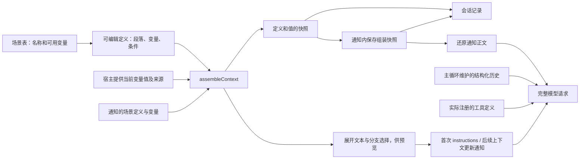

# 上下文组装器

目标是直接展示并编辑某个时机的上下文组装结构：段落双击编辑，条件分支显示为页签，动态内容显示为 chip。界面和后端使用同一份定义；不是另外维护一份只供展示的提示词说明，也不要求用户先为会话选择工作模式。

当前实现位于 `kited/src/harness/context/`，已用于终端 harness 的每次模型请求。核心是一份组装契约及其薄的展开函数，覆盖基础指令和通知正文；历史、工具调用结果和工具定义仍保留完整请求中的原有结构。agent 配置已绑定到实例并提供 HTTP 入口；配置与上下文变化通过追加通知接入。前端编辑器、普通文件通知、压缩和 token 预算尚未接入。

## 场景契约

`scenes.ts` 的 `contextScenes` 是场景名称与可用变量的唯一目录，`ContextScene` 从表的键派生，`ContextVariable<S>` 从对应场景的变量名派生。不单独维护枚举或第二份前端变量清单。

| 场景 | 可用变量 | 业务调用方的用途 |
|---|---|---|
| `thread.create`（创建会话） | `environment.cwd`、`environment.date`、`project.documents` | 为会话建立基础上下文；后续重新取值，变化以通知追加 |
| `thread.file_changes`（会话中文件变化） | `files.changes`、`files.origin` | 表达变化列表和来源；目前只定义契约，事件收集与投递尚未实现 |
| `thread.configuration_changed`（会话配置变更） | `agent.revision`、`agent.model`、`agent.reasoning`、`agent.tools`、`agent.max_requests_per_turn` | 展开配置变更说明，随配置原子保存 |
| `thread.context_updated`（基础上下文更新） | `context.instructions` | 展开更新生效范围及新的基础上下文，在请求边界追加 |

场景统一使用 `thread.*`，在研阶段不为旧 `session.*` 名称保留兼容分支。

新组装定义包含 `scene`，不再包含自定义 `variables`。`id` 标识某份定义，`scene` 规定它适用的场景；同一场景可以有多份不同定义。前端从场景表获得名称及 chip 列表，后端按同一张表校验段落、条件和绑定中的变量。

场景只表达契约，不是调度器。哪个时机调用、变量值如何获取、结果放进基础指令还是环境通知、保留多久，由业务调用方负责。组装器不监听文件、不清空事件队列，也不根据场景启动模型请求。文件变化通知仍按之前约定在下一次自然请求前处理，不打断执行、不唤醒空闲会话。

## 数据流



`assembleContext` 是纯函数，同一份输入产生同一份指令。它不读取磁盘、不启动模型、不执行模板代码。宿主负责发现材料；组装器负责选择分支和展开；模型适配器负责网络协议转换。

## 定义与变量

`types.ts` 定义可 JSON 序列化的数据结构：

| 结构 | 含义 | 界面对应 |
|---|---|---|
| `ContextDefinition` | 版本、标识、名称、场景和有序内容块 | 一个组装视图 |
| `paragraph` | 稳定 id、标题、文字和变量组成的 `parts` | 可编辑段落，变量显示为 chip |
| `condition` | 检查一个变量，按文本精确匹配 `cases`，否则选 `otherwise` | 各分支的标题是页签 |
| `ContextBinding` | 变量的实际文本、可选文件路径及 SHA-256 | chip 的展开内容和来源 |
| `ContextSource` | 定义加本次变量绑定 | 一次组装的完整输入 |

条件可以嵌套，空分支不产生内容。变量是具名引用，普通文字中的 `${...}`、括号等不会被解释成变量；变量内容也不会被二次解析成模板。条件只做精确匹配，不内嵌 JavaScript 或表达式语言。

例如目录和日期这段定义：

```ts
{
  type: 'paragraph', id: 'environment', title: '运行环境',
  parts: [
    { type: 'text', text: '当前工作目录：' },
    { type: 'variable', name: 'environment.cwd' },
    { type: 'text', text: '。日期：' },
    { type: 'variable', name: 'environment.date' },
    { type: 'text', text: '。' },
  ],
}
```

变量须属于定义引用的场景，不能通过给定义增加 `variables` 来自行扩展。段落与分支的 id 在整份定义中唯一，条件的匹配值不能重复。全部分支的引用都须有效，但只有实际选中路径中的变量必须提供绑定；隐藏页签不会因为缺少运行材料而阻止另一个分支执行。宿主传入该场景不支持的变量会报错，避免拼错名称后静默漏掉指令。

新的定义采用 `version: 2`，加入场景归属。渲染沿用旧版规则：段内 `parts` 直接连接，选中分支递归展开，非空段落之间插入两个换行。标题、id、scene、未选中分支不进入指令。以后改变渲染规则、移除或重命名已有场景和变量，须升级契约版本并保留历史读取，不能让旧快照失效或被悄悄改写。

## 预览与实际执行

```ts
const source = projectContext(cwd, editedDefinition);
const assembly = assembleContext(source);

assembly.instructions; // 首次请求的指令，或后续上下文更新通知的正文
assembly.blocks;       // 选中的 branchId、段落、chip 的展开值及来源
assembly.snapshot;     // 完整定义及本次绑定，保留未选中分支供查看

const historical = restoreContext(savedSnapshot); // 校验摘要并还原已保存的快照
```

编辑器直接展示 `snapshot.definition` 的全部分支；`blocks` 标记这次实际选中了哪个分支。点击页签只是查看、编辑对应定义，运行时仍按实际变量值判断。`assembleContext` 处理新的场景定义；`restoreContext` 读取历史快照，两者共用同一段展开逻辑。历史预览不重新读取当前项目文件。

返回值与传入对象脱离引用。模型请求启动后修改原始定义或绑定，不会反过来改变已保存的快照或已发送的指令。界面的坐标、选中页签和编辑状态不属于运行定义。

## 请求边界与记录

`HarnessOptions.prepareRequest` 在每次自然请求前同步取得模型、工具、设置、上下文来源和待投递通知：

1. 校验配置、工具和上下文；失败则暂停回合，不消费待处理输入，也不调用模型。
2. 首次出现的上下文保存为 `context.prepared`，实际设置与工具声明保存为 `request.configured`。
3. 首次请求固定基础上下文；后续内容摘要变化时生成 `context.updated` 通知，正文明确替代范围。
4. 一条 `request.started` 同时保存 `contextId`、`configurationId`、输入 ID 与此次纳入的通知，再调用模型。
5. 请求继续使用首次 `instructions`，后续更新作为独立消息追加到历史。工具声明保持固定，通过允许集合与宿主执行器限制实际权限。

通知不启动模型；请求边界是一次同步截取，当前请求期间发生的变化留给下一次自然请求。详细的来源持久化、游标与恢复规则见 [线程通知投递](线程通知投递.md)。

## 通知正文

`notifications.ts` 提供配置变更和基础上下文更新的默认定义，以及将业务值投影为 `ContextBinding` 的函数。说明文字、段落和变量都在定义中，调用方只传实际配置或新指令内容。与 `projectContext` 一样，函数可接受同场景的其他定义；尚未提供通知定义的编辑 UI 或持久配置入口。

`ThreadNotification.context` 保存完整 `ContextSnapshot`。配置通知在配置提交时组装，随配置写入 SQLite；基础上下文更新在请求边界组装，随 `request.started.notifications` 写入 journal。通知内的快照与基础上下文的 `context.prepared` 快照分别保存，前者能独立还原当时的通知段落、条件选择和变量值。

Runner 在消费输入、推进通知游标之前确认快照可完整展开，纳入请求或重放记录时还原一次正文。后续模型请求复用首次指令和通知的展开文本，通知只携带元数据与正文，完整定义及变量留在 journal 供预览。订阅适配器只映射角色和协议，不再拼接通知说明。来源标记、环境事实提示也应由相应场景定义表达。已投递的通知不读取当前模板或最新材料，后续修改不会改变已有历史前缀。

正文定义不能改变通知权限或执行配置。`authority` 仍由宿主确定，工具、模型参数和请求预算仍由执行层应用。

快照沿用现有 journal 的同步落盘，不另建数据库或文件存储。已有的模型输出、用户输入、工具结果仍在原记录中，不为每次请求重复保存整段历史。旧 journal 中没有 `contextId` 的请求可以正常恢复，只是无法还原当时未保存的指令。新请求若引用不存在的快照，或快照摘要不匹配，则拒绝当作完整记录恢复。

已经保存的 `version: 1` 快照保留其中的变量声明，通过 `restoreContext` 读取，内容及 id 原样保留。实时 `assembleContext` 只接受新版定义，旧格式不能作为绕过场景约束的入口。journal 的记录版本与定义版本独立，这次没有更改 journal 格式版本。

上下文快照保存指令定义和材料；请求配置快照另外保存模型设置、预算和工具声明。它们不保存凭据或执行闭包；历史中的恢复反馈仍由主循环生成。以后若要展示、编辑这些部分，须保留各自的结构与协议约束，不能把 reasoning 原始字段或工具结果拍平成可任意拼接的文本。

## 终端宿主接入

`project.ts` 的 `defaultContextDefinition` 归属 `thread.create`，承接原有默认提示词，其中工作目录、UTC 日期和项目材料变为变量；项目材料的有无变为显式条件。变量由 `projectContext` 提供，绑定类型从场景表派生；该宿主不接受文件变化场景的定义。

每次请求沿工作目录向上找到最近仓库根目录；无仓库则走到文件系统根。按照由外到内的顺序读取 `AGENTS.md` 和 `.kite/memory/MEMORY.md`，保存当次读取的文本和文件摘要。子目录规则、记忆正文仍按需读取。多个文件暂时合并在 `project.documents` 这一枚 chip 中，来源列表保留各文件路径。

`openThreadHost.prepareRequest` 接收宿主提供的受管工具与通知游标，调用方返回当次配置。kited 从实例读取绑定配置，终端从自身 metadata 恢复入口设置；已投递的上下文与通知按 journal 原顺序还原。

项目材料的变化只在自然请求边界发现，不监听文件、不打断当前请求、不唤醒空闲会话。基础指令保持原样，变化追加成独立通知。历史查看始终用已保存的文本，磁盘后续变化不会改变旧快照。

## 验证范围

小测试覆盖工厂、组装器、journal 与模型请求的交接，包括请求进行中修改定义和材料、相同材料复用快照、组装失败后保留待处理输入、关闭重开后保留原生历史和工具结果，以及上下文更新追加后保持已有历史前缀。没有为枚举、查表、文字连接或单个条件判断逐项增加测试。
