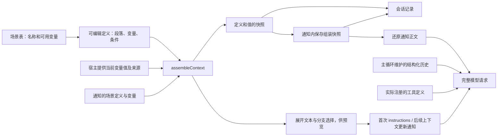

# 上下文组装器

目标是直接展示并编辑某个时机的上下文组装结构：段落双击编辑，条件分支显示为页签，动态内容显示为 chip。界面和后端使用同一份定义；不是另外维护一份只供展示的提示词说明，也不要求用户先为会话选择工作模式。

当前实现位于 `kited/src/harness/context/`，已用于终端 harness 的每次模型请求。核心是一份组装契约及其薄的展开函数，覆盖基础指令和通知正文；历史、工具调用结果和工具定义仍保留完整请求中的原有结构。agent 配置已绑定到实例并提供 HTTP 入口；配置与上下文变化通过追加通知接入。创建会话、标题生成及四类已接通通知的模板均已接目录存储和双端编辑器；普通文件通知、压缩和 token 预算尚未接入。统一编排首先为用户提供可见、可编辑、可保存的入口，即便只有一个调用点，也不能只接组装器而把提示词留在硬编码中。

## 模板编辑与使用入口

创建会话（`thread.create`）模板已接以下入口：

- 设置中管理和编辑上下文模板，编辑对象仍是 `ContextDefinition` 的段落、变量和条件分支。
- 新会话窗口的配置区域提供模板选择，选择适用于创建会话场景的模板。
- 创建会话时可以基于已有模板复制、修改并命名保存为新模板，随后使用新模板；原模板保留。
- 新模板保存到模板目录，之后创建其他会话时也可选择。设置和创建入口复用同一个编辑器。

沿用现有实例绑定语义：会话保存创建时采用的定义内容，模板后续编辑不自动改写已有实例。已有会话显式修改上下文时，继续在下一自然请求边界追加更新通知，保留已有历史前缀。

模板目录保存在当前工作机的 SQLite `context_templates` 表；Mac 和 iPhone 读取同一目录。启动时补齐缺少的 agent、标题及通知默认模板，重启不覆盖已保存的编辑。`GET /context-templates` 同时返回模板、内容 revision 和场景变量清单；`POST /context-templates` 新建创建会话模板，`PUT /context-templates/:id` 携带 `expectedRevision` 更新，不能改变模板的场景。版本冲突返回 409，编辑器保留草稿。标题及通知只开放当前仍在使用的固定模板，不提供未接实际调用的副本。

标题生成（`thread.title`）在设置中只提供一份“会话标题”模板（`kite.thread-title.generate`）。编辑器内分为命名规则和材料两个区域，共用一份定义、一个 revision 和一次保存；`blocks` 组装为模型指令，`input` 组装为输入正文。两个区域都能编辑段落、条件和变量，变量由业务提供当前标题及近期对话正文。自动生成和点击刷新每次读取最新保存内容，已发起的生成保留当次展开文本；不为标题模板提供脱离实际调用的副本。新会话选择器及后端绑定均只接受 `thread.create`，标题模板不会被应用为主会话上下文。

尚未创建实例的首消息请求可携带 `contextTemplate: {id, revision}`；已打开的空会话通过 `PUT /instances/:id/context-template` 携带实例配置 revision、模板 ID 和模板 revision 绑定，保存期间禁用发送。两条路径都在首个模型请求前完成选择，只替换上下文，保留模型、工具、预算及授权。新会话未选择时使用对应 agent 默认模板的最新内容。工作树边界由宿主绑定实例时追加。

## 场景契约

`scenes.ts` 的 `contextScenes` 是场景名称与可用变量的唯一目录，`ContextScene` 从表的键派生，`ContextVariable<S>` 从对应场景的变量名派生。不单独维护枚举或第二份前端变量清单。

| 场景 | 可用变量 | 业务调用方的用途 |
|---|---|---|
| `thread.create`（创建会话） | `environment.cwd`、`environment.date`、`project.documents` | 为会话建立基础上下文；后续重新取值，变化以通知追加 |
| `thread.title`（生成会话标题） | `thread.title`、`thread.messages` | 为自动生成及显式刷新标题组装命名规则与对话材料 |
| `thread.file_changes`（会话中文件变化） | `files.changes`、`files.origin` | 表达变化列表和来源；目前只定义契约，事件收集与投递尚未实现 |
| `thread.configuration_changed`（会话配置变更） | `agent.revision`、`agent.model`、`agent.reasoning`、`agent.tools`、`agent.max_requests_per_turn` | 展开配置变更说明，随配置原子保存 |
| `thread.context_updated`（基础上下文更新） | `context.instructions` | 展开更新生效范围及新的基础上下文，在请求边界追加 |
| `thread.execution_permissions_changed`（执行授权变更） | `execution.revision`、`execution.grants` | 展开规范化后的授权，随实例授权原子保存 |
| `thread.plugin_tools_changed`（插件工具授权变更） | `plugin.tools` | 展开当前获准的插件工具及目标，随授权变更保存 |

场景统一使用 `thread.*`，在研阶段不为旧 `session.*` 名称保留兼容分支。

新组装定义包含 `scene`，不再包含自定义 `variables`。`id` 标识某份定义，`scene` 规定它适用的场景；同一场景可以有多份不同定义。前端从场景表获得名称及 chip 列表，后端按同一张表校验段落、条件和绑定中的变量。

场景只表达契约，不是调度器。哪个时机调用、变量值如何获取、结果放进基础指令还是环境通知、保留多久，由业务调用方负责。组装器不监听文件、不清空事件队列，也不根据场景启动模型请求。文件变化通知仍按之前约定在下一次自然请求前处理，不打断执行、不唤醒空闲会话。

## 数据流



`assembleContext` 是纯函数，同一份输入产生同一份指令。它不读取磁盘、不启动模型、不执行模板代码。宿主负责发现材料；组装器负责选择分支和展开；模型适配器负责网络协议转换。

## 定义与变量

`types.ts` 定义可 JSON 序列化的数据结构：

| 结构 | 含义 | 界面对应 |
|---|---|---|
| `ContextDefinition` | 版本、标识、名称、场景和有序内容块；标题场景另有 `input` 材料块 | 一个模板及其编辑区域 |
| `paragraph` | 稳定 id、标题、文字和变量组成的 `parts` | 可编辑段落，变量显示为 chip |
| `condition` | 检查一个变量，按文本精确匹配 `cases`，否则选 `otherwise` | 各分支的标题是页签 |
| `ContextBinding` | 变量的实际文本、可选文件路径及 SHA-256 | chip 的展开内容和来源 |
| `ContextSource` | 定义加本次变量绑定 | 一次组装的完整输入 |

条件可以嵌套，空分支不产生内容。变量是具名引用，普通文字中的 `${...}`、括号等不会被解释成变量；变量内容也不会被二次解析成模板。条件只做精确匹配，不内嵌 JavaScript 或表达式语言。

例如目录和日期这段定义：

```ts
{
  type: 'paragraph', id: 'environment', title: '运行环境',
  parts: [
    { type: 'text', text: '当前工作目录：' },
    { type: 'variable', name: 'environment.cwd' },
    { type: 'text', text: '。日期：' },
    { type: 'variable', name: 'environment.date' },
    { type: 'text', text: '。' },
  ],
}
```

变量须属于定义引用的场景，不能通过给定义增加 `variables` 来自行扩展。段落与分支的 id 在整份定义中唯一，条件的匹配值不能重复。全部分支的引用都须有效，但只有实际选中路径中的变量必须提供绑定；隐藏页签不会因为缺少运行材料而阻止另一个分支执行。宿主传入该场景不支持的变量会报错，避免拼错名称后静默漏掉指令。

当前定义采用 `version: 2`，包含场景归属。段内 `parts` 直接连接，选中分支递归展开，非空段落之间插入两个换行。标题、id、scene、未选中分支不进入指令。在研期间只支持当前契约；契约升级可以明确退出旧格式，不迁移或悄悄改写旧快照。

## 预览与实际执行

```ts
const source = projectContext(cwd, editedDefinition);
const assembly = assembleContext(source);

assembly.instructions; // 首次请求的指令，或后续上下文更新通知的正文
assembly.blocks;       // 选中的 branchId、段落、chip 的展开值及来源
assembly.input;        // 标题场景的材料正文；其他场景没有该字段
assembly.inputBlocks;  // 材料区实际展开的段落与分支
assembly.snapshot;     // 完整定义及本次绑定，保留未选中分支供查看

const historical = restoreContext(savedSnapshot); // 校验摘要并还原已保存的快照
```

编辑器直接展示 `snapshot.definition` 的全部分支；`blocks` 标记这次实际选中了哪个分支。点击页签只是查看、编辑对应定义，运行时仍按实际变量值判断。`assembleContext` 处理新的场景定义；`restoreContext` 读取历史快照，两者共用同一段展开逻辑。历史预览不重新读取当前项目文件。

返回值与传入对象脱离引用。模型请求启动后修改原始定义或绑定，不会反过来改变已保存的快照或已发送的指令。界面的坐标、选中页签和编辑状态不属于运行定义。

## 请求边界与记录

`HarnessOptions.prepareRequest` 在每次自然请求前同步取得模型、工具、设置、上下文来源和待投递通知：

1. 校验配置、工具和上下文；失败则暂停回合，不消费待处理输入，也不调用模型。
2. 首次出现的上下文保存为 `context.prepared`，实际设置与工具声明保存为 `request.configured`。
3. 首次请求固定基础上下文；后续实际展开的指令正文变化时生成 `context.updated` 通知。标题、来源摘要或未选中分支变化只影响历史快照，不产生相同正文的通知。
4. 一条 `request.started` 同时保存 `contextId`、`configurationId`、输入 ID 与此次纳入的通知，再调用模型。
5. 请求继续使用首次 `instructions`，后续更新作为独立消息追加到历史。工具声明保持固定，通过允许集合与宿主执行器限制实际权限。

通知不启动模型；请求边界是一次同步截取，当前请求期间发生的变化留给下一次自然请求。详细的来源持久化、游标与恢复规则见 [线程通知投递](线程通知投递.md)。

## 通知正文

`notifications.ts` 提供配置变更、基础上下文更新、执行授权及插件工具授权变更的默认定义，以及将业务值投影为 `ContextBinding` 的函数。设置中的模板目录按这四个场景提供编辑入口，使用与创建会话相同的段落、变量 chip 和条件页签编辑器。

配置、执行授权和插件工具通知在业务变更提交时，从目录读取对应模板，再与实际值一起固定为快照。基础上下文更新由宿主在 `prepareRequest` 中提供当次 `contextUpdateTemplate`；Runner 发现展开后的基础正文确实变化时才生成通知，已打开的 Runner 在下一请求也能读到新的模板。独立终端未连接工作机目录时沿用内置通知定义。

保存模板本身不产生通知、不唤醒模型、不修改实例设置或权限。已经生成但尚未投递的通知仍沿用生成时的快照；后续模板修改只影响之后生成的通知。基础上下文正文未变化时，仅编辑通知模板不会额外追加一次更新。

`ThreadNotification.context` 保存完整 `ContextSnapshot`。配置通知在配置提交时组装，随配置写入 SQLite；基础上下文更新在请求边界组装，随 `request.started.notifications` 写入 journal。通知内的快照与基础上下文的 `context.prepared` 快照分别保存，前者能独立还原当时的通知段落、条件选择和变量值。

Runner 在消费输入、推进通知游标之前确认快照可完整展开，纳入请求或重放记录时还原一次正文。后续模型请求复用首次指令和通知的展开文本，通知只携带元数据与正文，完整定义及变量留在 journal 供预览。订阅适配器只映射角色和协议，不再拼接通知说明。来源标记、环境事实提示也应由相应场景定义表达。已投递的通知不读取当前模板或最新材料，后续修改不会改变已有历史前缀。

正文定义不能改变通知权限或执行配置。`authority` 仍由宿主确定，工具、模型参数和请求预算仍由执行层应用。

快照沿用现有 journal 的同步落盘，不另建数据库或文件存储。已有的模型输出、用户输入、工具结果仍在原记录中，不为每次请求重复保存整段历史。`request.started` 必须包含 `contextId` 和 `configurationId`；缺失、引用不存在的快照或快照摘要不匹配时，拒绝恢复。Runner 只缓存首次指令、当前有效正文与固定工具声明；其余快照保存 ID，用于校验关联，完整内容由 journal 保留。

`assembleContext` 与 `restoreContext` 都只接受 `version: 2` 定义，已退出旧的自定义变量声明格式。journal 的记录版本与定义版本独立，记录版本仍为 1。

上下文快照保存指令定义和材料；请求配置快照另外保存模型设置、预算和工具声明。它们不保存凭据或执行闭包；历史中的恢复反馈仍由主循环生成。以后若要展示、编辑这些部分，须保留各自的结构与协议约束，不能把 reasoning 原始字段或工具结果拍平成可任意拼接的文本。

## 终端宿主接入

`project.ts` 的 `defaultContextDefinition` 归属 `thread.create`，承接原有默认提示词，其中工作目录、UTC 日期和项目材料变为变量；项目材料的有无变为显式条件。变量由 `projectContext` 提供，绑定类型从场景表派生；该宿主不接受文件变化场景的定义。

每次请求沿工作目录向上找到最近仓库根目录；无仓库则走到文件系统根。按照由外到内的顺序读取 `AGENTS.md` 和 `.kite/memory/MEMORY.md`，保存当次读取的文本和文件摘要。子目录规则、记忆正文仍按需读取。多个文件暂时合并在 `project.documents` 这一枚 chip 中，来源列表保留各文件路径。

`openThreadHost.prepareRequest` 接收宿主提供的受管工具与通知游标，调用方返回当次配置。kited 从实例读取绑定配置，终端从自身 metadata 恢复入口设置；已投递的上下文与通知按 journal 原顺序还原。

宿主只采集实际选中路径用到的变量，未引用或隐藏分支中的项目材料不读取。材料的变化只在自然请求边界发现，不监听文件、不打断当前请求、不唤醒空闲会话。基础指令保持原样，有效正文变化追加成独立通知。历史查看始终用已保存的文本，磁盘后续变化不会改变旧快照。

## 验证范围

小测试覆盖工厂、组装器、journal 与模型请求的交接，包括请求进行中修改定义和材料、相同材料复用快照、组装失败后保留待处理输入、关闭重开后保留原生历史和工具结果，以及上下文更新追加后保持已有历史前缀。没有为枚举、查表、文字连接或单个条件判断逐项增加测试。
