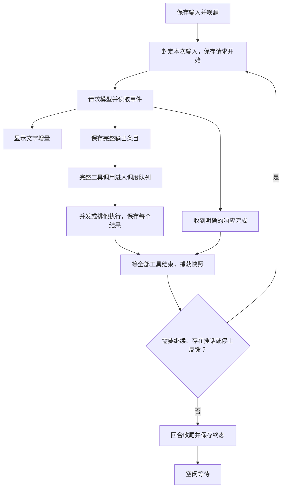

# Harness 主循环设计

2026-09-26。按本次确认的方向实现主循环内核。模型调用、工具调度、上下文与记录由 Kite 自己管理，不经过 Claude Code 或 Codex CLI。ChatGPT 订阅已通过真实请求验证，独立终端入口可用；凭据通过官方设备登录单独授权到 Kite 目录，自动刷新尚未实现。

## 1. 范围与三层结构

每个会话在宿主的 Bun 进程里有一个执行者。当前宿主是独立终端，后续接入 kited。空闲时等待事件，不发模型请求；不同会话可并行，同一会话最多一个模型请求。

1. **控制入口**接收并保存输入，处理撤回、打断、继续与关闭。不能被正在等待的模型或工具阻塞。
2. **回合循环**组装上下文，调用模型，收齐工具结果，判断继续或结束。
3. **响应流与工具调度**展示增量；完整输出条目先保存，再调度工具；允许声明为可并发的工具重叠执行。

这里「回合」指从处理输入到完成、失败或打断的一次工作，里面可以有很多次模型请求。模型给出文字不等于回合完成，正常完成也不代表业务目标经独立验证已经达成。



流和工具执行可以重叠，但下一次模型请求必须等本次响应与全部工具结束、工具批次快照完成。流异常同样要停止并收齐已经启动的工具。

## 2. 必须守住的边界

- 用户输入追加并同步到磁盘后才确认接收。同 id 同内容重试去重，同 id 不同内容拒绝。
- 工具参数不完整时不能执行；完整条目保存后，还要保存 `tool.started`，才能进入工具函数。
- 每个已保存的调用必须得到结果：成功、错误、未执行或结果未知。调用失败是交给模型的信息；存储失败则阻止后续副作用。
- 打断取消的是调用时正在进行的回合。工具和快照尚未收尾时始终 busy，不得回退、采纳或启动下一回合。
- 恢复绝不自动重跑旧调用。有开始、没结果的调用记为结果未知；宿主确认残留执行已停止前，会话保持恢复阻塞。
- 主循环不实现凭据刷新、HTTP、git 或具体 shell 工具。模型与工具必须遵守取消契约，否则内核会继续等待，不能假装已经安全停下。

## 3. 模块与公开接口

| 文件 | 职责 |
|---|---|
| `kited/src/harness/types.ts` | 模型流、工具、记录、事件与宿主回调的公开契约 |
| `kited/src/harness/session.ts` | 控制入口、回合循环、上下文投影、恢复与收尾 |
| `kited/src/harness/context/` | 指令组装定义、变量与条件展开、项目材料发现及指令快照 |
| `kited/src/harness/journal.ts` | 单写者 JSONL、记录校验、同步落盘、末尾半行修复 |
| `kited/src/harness/tools.ts` | 按调用次序调度、并发与排他边界、参数校验、取消与结果 |
| `kited/src/harness/chatgpt.ts`、`auth.ts` | ChatGPT 订阅 Responses SSE 适配、只读登录缓存 |
| `kited/src/harness/local-tools.ts`、`command.ts` | 文件读写与精确编辑、命令输出与进程组生命周期 |
| `kited/src/harness/terminal-session.ts` | 项目指令、会话锁、元数据与进程登记 |
| `kited/src/harness-cli.ts` | 终端对话、插话、打断、恢复与单次任务入口 |

`new HarnessSession(options)` 接收工作目录、指令、journal、model、tools 和回调。`FileJournal(path)` 放在宿主选定的 `KITE_HOME/sessions/<会话>/journal.jsonl`。这些模块不导入 Claude SDK。

接口正文在 `types.ts`，控制方法为：

- `send({id, text, source})`：可靠接收，解除普通错误暂停并推进；恢复阻塞时只能排队。
- `cancel(inputId)`：只撤回尚未纳入请求的输入。
- `interrupt()`：停止调用时的回合，等它的执行与收尾完全结束；后来排队的输入保留。
- `resume()`：显式继续普通错误或崩溃后暂停的上下文；不需要伪造一条用户消息。
- `confirmRecovery()`：宿主已经确认残留执行停止后解除恢复阻塞，只变为暂停，不自动续跑。
- `shutdown()`：停止接收，取消当前工作并等待收尾，保留未处理输入，释放 journal。
- `settled()`：供宿主和测试等待推进停下，含排队回合与收尾。

状态是 `idle / running / stopping / finishing / paused / needs_recovery / closed`，附带 busy、turnId 和上一回合结果。回合结果为 `completed / interrupted / failed / needs_recovery`。

## 4. 模型流与上下文

模型适配器实现 `stream(request, signal)`，返回异步事件流：

- `delta`：只用于显示，不逐 token 保存。
- `item`：完整的原生输出条目，携带稳定 item id；如果是本地调用，同时给出 call id、工具名和完整参数。
- `completed`：成功的显式结束，包含 response id、用量和可选的 `needsFollowUp`。必须是最后一个事件；连接关闭、断流、截断和解析错误不是成功。

收到一个完整 item 就保存它；有工具则立刻排队，无需等整次响应结束。工具调用 id 不能重复，避免下一次请求中的调用与结果错配。流中断前已经完整保存的条目与已经产生的工具结果保留，并给后续上下文明确的失败/中断反馈；未完成条目不用于续跑。

上下文按请求分组投影：本次纳入的用户输入 → 原生模型输出（原顺序）→ 工具结果（调用顺序）。工具实际完成顺序可以不同，不能因此把结果插进尚未收完的模型输出中。停止 hook、打断、恢复和失败说明也进入上下文。保留 reasoning 等 opaque 字段，适配器负责投影成订阅端点要求的原生请求，不能从 UI 文本重建模型输入。

指令由宿主提供字符串、结构化定义和值，或每请求调用的同步工厂。独立的[上下文组装器](harness-上下文组装.md)展开段落、变量和条件；发送前先保存 `context.prepared` 快照，`request.started.contextId` 关联当次版本，相同内容复用快照。组装失败不消费待处理输入。终端宿主每次请求沿工作目录到最近仓库根目录加载 `AGENTS.md` 与 `.kite/memory/MEMORY.md`，无仓库时沿父目录查找；子目录指令与记忆正文由模型按需读取。

内核仍不做自动压缩或 token 估算。`maxRequestsPerTurn` 是可选的显式请求预算，达到时暂停并报告原因；不是成功，也不自动唤醒。终端默认 50 次。

订阅适配器直接请求 `https://chatgpt.com/backend-api/codex/responses`，使用原生输出条目回传 reasoning 与 function call，再按 call id 追加工具结果。SSE 支持 UTF-8 跨块、CRLF 与多行 data；只有完整输出事件或完成响应中的完整条目进入内核，参数增量不会执行。请求取消会释放响应流；断流、失败响应和解析错误不自动重试。

认证默认读取 `$KITE_HOME/auth/chatgpt/auth.json`，不读取日常 Codex 的认证目录。设备授权借用官方 `codex login --device-auth`，为该命令指定 Kite 的独立 `CODEX_HOME`；模型循环不依赖该进程。每台工作机独立登录，不同步 refresh token。harness 每次请求只读凭据，自动刷新与系统钥匙串支持尚未实现，过期后在同一目录重新授权。协议依据 [Codex v0.157.0 Responses 请求源码](https://github.com/openai/codex/blob/rust-v0.157.0/codex-rs/codex-api/src/endpoint/responses.rs) 和真实返回结果，认证入口参考 [官方说明](https://learn.chatgpt.com/docs/auth)。

## 5. 工具调度

工具声明名称、说明、参数 schema、参数校验函数与执行函数。默认排他，只有 `parallel: true` 的工具允许重叠执行。这个标志由宿主定义工具时设置，模型不能自行打开。

队列保持到达顺序：一段连续的可并发工具同时运行；遇到排他工具，等前面全部结束，独占执行；后续工具不能越过排他调用。不预先分析命令字符串来猜测只读性。

例如 `读 A、读 B、写 C、读 D`：A/B 可并发，C 等 A/B，D 等 C。调度开始前再次检查 signal，保存开始记录后才执行。未知工具或参数错误直接生成错误结果，不执行。工具抛错作为普通工具错误，交回模型。

执行函数必须在返回前停止受管执行。取消时，未启动的调用得到 `not_executed`；已启动、被取消且无法说明完成效果的调用得到 `unknown`。即使工具已停止，unknown 也不能解释成修改已回滚。工具主动报告 unknown 会阻塞后续副作用，等待宿主确认。

每个工具结果完成后立即保存；所有已保存调用收齐后等待 `afterTools(turnId, callIds)`，再决定下一次模型请求。具体工具的输出限长、完整日志、子进程 env 和进程组生命周期由工具适配层负责。

终端提供 `read`（可并发）、`patch`、`shell`（排他）。`read` 目前只读文本，未来扩展图片、PDF 时仍沿用同一入口，同时扩展工具结果和模型适配器。文件工具继续检查目录边界和符号链接。

`patch` 合并创建、修改、删除，参数为 `{ operations: [...] }`，每项使用 `type`（`create_file`、`update_file`、`delete_file`）和 `path`，创建与修改还需 `diff`。`diff` 是无文件头的 V4A 正文，解析和匹配复用固定版本 `@openai/agents-core/utils` 的 `applyDiff`，不引入其 agent 循环。外层仍是 Kite 的普通函数工具，不绑定某个供应商的专用工具协议。匹配沿用上游的上下文定位与空白容错，需要足够上下文区分重复片段；不沿用旧 `edit_file` 的唯一子串替换规则。

例如，创建一个带末尾换行的文件：

```json
{"operations":[{"type":"create_file","path":"note.txt","diff":"+甲\n+乙\n+丙\n+"}]}
```

把中间一行改为「丁」：

```json
{"operations":[{"type":"update_file","path":"note.txt","diff":"@@\n 甲\n-乙\n+丁\n 丙"}]}
```

同批不重复操作同一文件；所有路径和补丁先预检、计算，再依次写入。无效补丁在落盘前失败，新建使用排他创建避免覆盖已有文件。文件系统写入不是事务：若落盘阶段失败，结果列出已完成的操作及失败文件，不自动回滚或重放整批。

文件版本跟踪只提供提示，不构成编辑门槛。`read` 记录从同一次文件读取计算出的内容 hash（即使只返回部分行）；成功 `patch` 刷新已知版本，避免把自身修改误报为外部变化。修改或删除已有文件时，没有记录或 hash 变化都允许继续，成功结果提示模型按需重读；旧内容匹配失败仍拒绝。整文件 hash 变化不导致其他位置的局部修改被拒绝，也不对删除另加读后版本锁。

版本表目前属于一次 `localTools` 实例，不落盘；终端恢复后重新建立，提示明确写「本次运行」。shell 读取不登记到版本表，shell 修改会在后续 patch 比对时体现。这个表只表示宿主已知的文件版本，不能据此推断全文仍在模型上下文中。持久化快照引用、可见范围、skill 加载和压缩后的重组留给后续上下文管理设计，不要求每次 read 提交整个工作树。

shell 显式传入 env，独立进程组执行，完整输出写日志并仅返回末尾；取消或超时先 TERM 再 KILL，确认组内进程停止后才返回。无法确认停止时返回 unknown。首版不支持后台任务，shell 也不是操作系统沙箱。

## 6. 插话、撤回与结束边界

接收与纳入是两件事，分别保存 `input.received` 和携带 inputIds 的 `request.started`。纳入表示用于这次请求，不承诺远端已经读到。

| 消息到达时机 | 行为 |
|---|---|
| 空闲 | 开始新回合 |
| 模型生成或工具执行中 | 排队，在下一次请求边界纳入当前回合 |
| 模型已给最终文字，但尚未裁定停止 | 有排队消息则继续当前回合 |
| 已进入回合收尾 | 等收尾完成后开启新回合 |
| 打断中 | 排队，旧回合收尾后开启新回合 |
| 普通请求失败后 | 保留队列并暂停，显式 resume 或新输入才继续 |
| 恢复阻塞 | 只保存，不执行 |

结束判断是：本次请求正常完成，所有工具结果收齐，没有模型继续标记，没有排队输入，且 `beforeStop` 没有返回继续反馈。停止反馈也消耗请求预算，不能绕过预算无限循环。

输入持久化、去重、撤回和请求封定使用短同步段，中间不 await。网络、工具和快照均在同步段外等待。pump 标记的清除与再次检查队列也处在同一个同步段，避免丢失唤醒。

## 7. 打断与错误

每回合一个 AbortController。打断首先阻止新调用，再取消模型和工具；不能只关闭 HTTP 连接。`interrupt()` 等待当时那个回合的完成承诺，不因后来的新回合延长等待。

若消息刚接收、还没进入第一次请求就立即打断，撤回此次待开始回合的输入。已纳入请求的输入保留在上下文中，记录中断事实。停止期间后来到达的消息不受影响。

收尾不使用已取消的 signal：等工具完成、补齐结果、等待批次快照和 `afterTurn`，最后保存回合终态。busy 覆盖整个过程。通知 UI 的回调异常只报告错误，不改变执行顺序。

进入 `afterTurn` 后，回合的停止裁定已经完成；此时 interrupt 只等待收尾，不再修改传给宿主的结果。宿主不能在这些等待中的回调里反过来 await 同一会话的 interrupt、shutdown 或 settled，否则会循环等待。

错误分开处理：工具错误通常继续；模型断流/协议错误暂停；快照回调失败暂停并报告；存储失败或结果未知进入恢复阻塞。内核不自动重试模型请求。部分响应已执行工具后，不允许通过重新请求偷偷重跑旧调用。

## 8. 记录和恢复

同一会话只有一个 journal 写入者，宿主负责跨进程互斥。每条记录有 version、seq、时间和相关 turn/request/call id。JSONL 是唯一正文，数据库仅存会话登记。创建文件和追加记录都要落盘；写入失败后该 journal 禁止继续追加。

终端宿主用会话目录里的原子 `lock/` 保证互斥，另存工作目录、模型配置和受管进程组。正常关闭等待内核完全结束再释放锁；异常退出的锁须确认旧执行停止后人工清理。进程登记用于拒绝不安全的恢复，不凭旧 PID 自动杀进程。独立终端不写现有 kited 数据库。

读取时校验格式与序号。末尾无换行的半条记录先存诊断副本再截断修复；中间损坏或结构不合法直接拒绝加载，不跳过。不支持未知版本。

| 恢复时看到的情况 | 行为 |
|---|---|
| 只有已接收、未处理输入 | 恢复队列，可以正常推进 |
| 存在未结束回合 | 先补齐未完成调用和中断记录，暂停，等显式继续 |
| 保存了调用但没开始记录 | 补未执行结果，不重跑 |
| 有开始、没结果 | 补 unknown，进入恢复阻塞 |
| 工具结果已保存 | 原样复用，后续模型请求看到相同结果 |
| 上次正常 shutdown 留了排队输入 | 新实例继续处理这些输入 |

不承诺外部副作用 exactly-once。记录 unknown 不能证明残留进程已经停止；`confirmRecovery()` 只能由已完成实际清理/检查的宿主调用。journal 已写失败时不允许就地确认，须重新打开并检查恢复状态。

## 9. 当前实现与后续接入

当前交付独立内核、ChatGPT 订阅模型适配器、文件/命令工具、项目上下文装配与终端入口。运行方式见 [kited README](../kited/README.md#终端试用)。终端直接操作指定目录；现有 HTTP 默认仍使用旧 `Runner`，App 仍使用假数据。

后续补 kited runtime 路由与记录事件接口、原有 check 的结构化事件、App 真实对话，再补自有认证、skill/子 agent 与上下文压缩。接 kited 时把 `afterTools`、`afterTurn` 接到工作树快照，冲突后的自动采纳只允许在正常完成且无冲突、无 pending 输入时触发。旧 Claude 会话不自动改 runtime。

## 10. 验证

测试由 test-writer 写在 `kited/test/small/`，直接调内核，使用事件闸门，不用真实订阅或 Claude 进程，不用 sleep。首批最多 8 个行为测试：流式调度与持久化/快照边界、并发与排他顺序、插话与停止反馈、打断及排队输入、去重撤回、断流与存储故障、崩溃恢复与结果复用、JSONL 损坏和末尾修复。通过 `.kite/check` 后记录实际结果。

2026-09-26 内核阶段验证：新增 8 个小测试、100 个断言，定向运行全部通过；该阶段 `.kite/check` 退出码 0，类型检查、lint 和 App 编译通过，受影响测试共 26 个、10.9 秒。故障注入包含工具开始/结果/回合终态写入失败；打断测试同时覆盖首个请求前关闭保留输入、收尾期间仍 busy。

订阅与终端阶段新增 6 个小测试、100 个断言，覆盖分段 SSE、调用与结果回传、断流取消、凭据只读、文件边界、命令环境与进程组停止、会话锁和恢复。真实订阅验证包括：一次纯文本回复；临时目录写入 `hello.txt` 并用 shell 读回；退出后由新进程恢复同一会话，用精确编辑追加一行并读回。交互式 `/status`、`/exit` 也已验证。

该阶段最终 `.kite/check` 退出码 0：类型检查、lint 与 App 编译通过，全量 32 个测试通过，测试耗时 12.1 秒。自动测试不使用真实订阅额度，以上真实请求验证单独在临时目录执行。

参考：[Claude 循环](https://code.claude.com/docs/en/agent-sdk/agent-loop)、[Codex 循环](https://openai.com/index/unrolling-the-codex-agent-loop/)、[Codex 调度源码](https://github.com/openai/codex/blob/rust-v0.157.0/codex-rs/core/src/tools/parallel.rs)。这里采用的是职责和时序边界，不复制上游完整功能。
