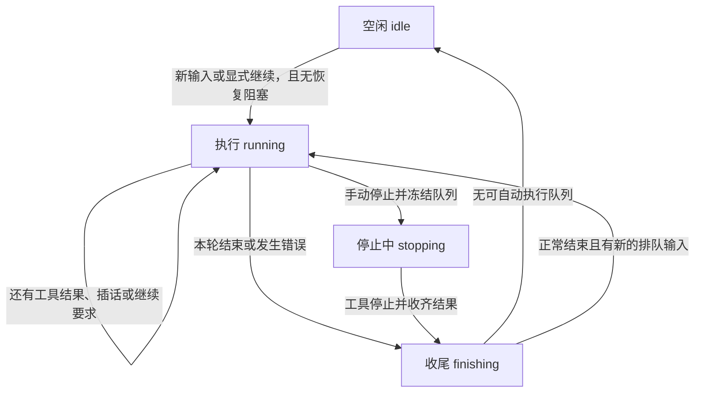

# 会话状态机与统一状态 chip

本文按 2026-09-28 的重构实现说明状态、停止行为与统一状态 chip；上下文窗口上限仍待模型适配器提供。

## 状态的归属

「会话」指产品模型的 `Thread`。`HarnessRunner` 是执行实例，关闭实例不删除会话或历史。

| 层次 | 字段 | 含义 |
| --- | --- | --- |
| 工作区生命周期 | `Workspace.status`：`preparing / open / failed / archived` | 目录是否可用；这里的 failed 是工作区准备失败 |
| agent 持久生命周期 | `PluginInstance.status`：`open / archived` | 实例是否归档；ThreadContext 联表读取 |
| 执行阶段 | `ThreadState.phase`：`idle / running / stopping / finishing` | 当前本地执行到了哪里 |
| 执行占用 | `busy` | 本地仍有 pump、模型、工具或收尾在执行，不包含恢复阻塞 |
| 上一回合结果 | `lastOutcome`：`completed / interrupted / failed` | 上一回合如何结束；新回合开始时清除旧结果 |
| 等待继续 | `waitingForResume` | 禁止自动消费队列，可由新输入或 resume 显式推进 |
| 恢复阻塞 | `recovery?: {message}` | 结果未知或记录故障，需要核查，不能直接发送或继续 |
| 实例生命周期 | `runner.lifecycle`：`open / closing / closed` | 执行实例是否关闭，与线程归档和执行阶段分开 |
| 工具结果 | `success / error / not_executed / unknown` | 单次调用的结果；普通工具错误可交回模型处理 |
| 客户端状态 | 连接、投递和停止请求是否已确认 | 不改变服务端的执行阶段 |

类型见 [harness/types.ts](../kited/src/harness/types.ts)；历史和实时显示统一走 [transcript.ts](../kited/src/transcript.ts)。显示协议传递 phase、busy、waitingForResume、lastOutcome 和 recovery；App 按服务端 capabilities 开关操作。

## 四个执行阶段

| 阶段 | 含义 |
| --- | --- |
| `idle` | 本地没有正在推进的回合；须结合结果、等待条件和恢复阻塞判断可做什么 |
| `running` | 组装上下文、请求模型、执行工具、保存工具批次快照和判断是否继续 |
| `stopping` | 已发出取消，等待模型与工具确认停止 |
| `finishing` | 等待回合快照、宿主回调和终态保存 |

普通失败返回 `idle + failed + waitingForResume`，队列保留。手动停止退回队列，正常结束为 `idle + interrupted`，没有名为 paused 的阶段。普通失败的队列处理暂时沿用既有行为，没有把用户对手动停止的选择扩展为所有失败的规则。

工具结果 unknown、记录故障单独产生 recovery；清理尚未结束时仍可同时处于 stopping 或 finishing。结束后即使 busy=false，也不能据此假定宿主外的残留进程已停止。宿主核查后调用 confirmRecovery，只解除恢复阻塞，不自动请求模型；之后 send 或 resume 才推进。记录写入失败不能就地确认，必须重新打开核查。

只读历史发现未收尾回合时，显示 `idle + recovery`，不为读历史而唤醒模型或工具。管理宿主打开旧队列时使用 startPaused 策略，等待显式输入或继续。旧 journal 的 needs_recovery 结果在读取边界转换为 failed + recovery，不重写旧文件。

## 手动停止与消息交接

用户确定：**停止整个会话，尚在队列中的消息返回输入框。** 已执行的文件操作不撤销，已纳入请求的消息保留历史。

`POST /threads/:id/interrupt` 接收 `{id, inputs?}`，返回 `{returned}`。id 是本次停止操作的标识；inputs 是发起客户端尚未得到确认的消息（id、text、source）。

1. 服务端同步冻结自动推进，按 `request.started.inputIds` 判断哪些消息已纳入请求。
2. 保存一条 `thread.stopped {id, returned}` 收据，同时移出待处理队列并登记尚未到达的消息 id。
3. 取消模型与工具，等执行与收尾停止后返回收据。停止期间拒绝新的发送与继续。
4. App 将 returned 按顺序放到现有草稿前，移除队列和未确认占位；发送淡出尚未结束时先扣除已提交的文字，再恢复草稿。

同一停止 id 重试返回同一收据，重开实例后也成立。被退回消息的迟到发送或重试只做去重，不重新执行；重新发送草稿使用新消息 id。响应丢失时，App 保留停止请求并显示重试入口，确认之前不放行新发送。其他设备只收到 pending 变化，不重复生成草稿。终端没有多行草稿控件，打印退回正文供重新编辑，不向 readline 注入换行导致自动重发。

工作区锁只覆盖冻结入口，不覆盖等待停止的耗时过程，所以清理期间的其他控制请求能得到明确拒绝。手动停止同时清除该线程待自动采纳的意图。

进入 afterTurn 后，回合结果已经交给宿主；此时停止仍退回队列、等待收尾，但不追溯修改已传出的结果。宿主的收尾回调不能反向 await 同一实例的 interrupt、shutdown 或 settled，否则会循环等待。

shutdown 是关闭实例：停止当前执行并保留待处理输入，不生成用户停止收据，不改写任何客户端草稿。

## 显示与统一 chip

Mac 和 iOS 在输入控制区共用 `ThreadStatusChip`，不再依赖 iOS 底部安全区。思考在消息流中独立成行，展开后可回看，不计入工具数量、批次或连线；工具结果仍回填对应调用。

圆环颜色和动效表示四个主状态：idle 为静止的中性色，running 为主题色，stopping 为橙色，finishing 为紫色；后三者以不同节奏呼吸，系统开启减少动态效果时保持静止。弧长只表示上下文占用，圆环内不显示数字，不用颜色表示上下文风险或回合结果。

右侧文字在 stopping / finishing 时显示对应主状态，running 显示「运行中」；idle 有上一轮结果时显示结果（失败附原因），否则显示等待继续或空闲。恢复阻塞显示恢复原因，不增加第五个主状态。失败后的圆环仍表达 idle，结果由文字表达；新回合不沿用上一轮结果。暂不增加子状态或实时活动模型。

上下文用量经显示协议的可选 `state.context` 传递：

- `requestId`、`measuredAt` 标明测量属于哪次请求、何时取得，避免把上一请求的用量当成当前实时值。
- `inputTokens` 来自 `request.completed.usage.input_tokens`，实时推送和历史重放使用同一转换。新请求进行中保留上次测量；新完成请求缺少有效用量时清除旧测量。
- `windowTokens` 是可选的有效窗口上限；当前适配器尚未提供。缺少用量或上限时只显示圆环底轨，在提示中说明未知，不能填造 0% 或按模型名猜常量。用量详情可从 Mac 悬停提示及辅助功能标签读取。
- 假数据把有百分比的 chip 明确标为样式样本，虚构窗口只用于预览 0%、46%、99%、100%，不代表真实模型能力。

适配器仍只提供完整 reasoning 条目的 summary，没有实时思考摘要增量。思考原文保留在 transcript，与 chip 的主状态和结果独立。

验证集中在状态流转与跨层交接：停止与发送交错、收尾等待、收据持久化、迟到去重、恢复不自动推进、历史与实时一致，以及草稿和发送动画交错。界面效果由用户预览。
