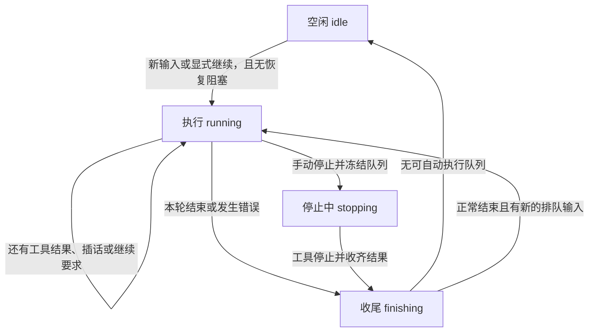

# 会话状态与停止契约

本文说明状态、停止行为与统一状态 chip；具体控件布局以 [App 说明](App.md) 为准，上下文窗口上限仍待模型适配器提供。

## 状态的归属

「会话」指持久的 Thread；执行进程关闭不删除会话或历史。本文中的执行字段采用显示协议含义，内部运行类型由代码定义。

| 层次 | 字段 | 含义 |
| --- | --- | --- |
| 工作区生命周期 | `preparing / open / failed / archived` | 目录是否可用；这里的 failed 是工作区准备失败 |
| agent 持久生命周期 | `open / archived` | 实例是否归档 |
| 执行阶段 | `phase`：`idle / running / stopping / finishing` | 当前本地执行到了哪里 |
| 执行占用 | `busy` | 本地仍有模型、工具或收尾在执行，不包含恢复阻塞 |
| 上一回合结果 | `lastOutcome`：`completed / interrupted / failed` | 上一回合如何结束；新回合开始时清除旧结果 |
| 等待继续 | `waitingForResume` | 禁止自动消费队列，可由新输入或 resume 显式推进 |
| 恢复阻塞 | `recovery?: {message}` | 结果未知或记录故障，需要核查，不能直接发送或继续 |
| 工具结果 | `success / error / not_executed / unknown` | 单次调用的结果；普通工具错误可交回模型处理 |
| 客户端状态 | 连接、投递和停止请求是否已确认 | 不改变服务端的执行阶段 |

历史和实时状态统一使用 [会话显示协议](会话显示协议.md)，App 按服务端 capabilities 开关操作。

## 四个执行阶段

| 阶段 | 含义 |
| --- | --- |
| `idle` | 本地没有正在推进的回合；须结合结果、等待条件和恢复阻塞判断可做什么 |
| `running` | 回合正在推进，可能等待模型、工具或批次快照 |
| `stopping` | 已发出取消，等待模型与工具确认停止 |
| `finishing` | 正在收尾，尚不能开始下一回合 |

普通失败返回 `idle + failed + waitingForResume`，队列保留。手动停止退回队列，正常结束为 `idle + interrupted`，没有名为 paused 的阶段。普通失败与手动停止采用不同的队列规则。

工具结果 unknown、记录故障单独产生 recovery；清理尚未结束时仍可同时处于 stopping 或 finishing。结束后即使 busy=false，也不能据此假定宿主外的残留进程已停止。确认恢复只解除恢复阻塞，不自动请求模型；之后发送或继续才推进。记录写入失败时须重新打开会话核查，恢复确认不能忽略记录故障。

只读历史发现未收尾回合时，显示 `idle + recovery`，不为读历史而唤醒模型或工具。管理宿主打开已有队列时等待显式输入或继续，不能因读取状态而推进执行。

## 手动停止与消息交接

**手动停止结束整个会话的当前执行，尚未纳入请求的消息返回输入框。** 已执行的文件操作不撤销，已纳入请求的消息保留历史。

`POST /threads/:id/interrupt` 接收 `{id, inputs?}`，返回 `{returned}`。id 是本次停止操作的标识；inputs 是发起客户端尚未得到确认的消息（id、text、source）。

停止后不再自动推进；仅退回尚未交给模型请求的输入，等执行与收尾停止后才确认完成。停止期间拒绝新发送和继续。发起客户端将 returned 按顺序放到已有草稿前，并移除对应队列和投递占位；与发送动画交错也不得重复或丢失草稿。

同一停止 id 重试返回同一收据，重开实例后也成立。被退回消息的迟到发送或重试只做去重，不重新执行；重新发送草稿使用新消息 id。响应丢失时，App 保留停止请求并显示重试入口，确认之前不放行新发送。其他设备只收到 pending 变化，不重复生成草稿。终端打印退回正文供用户重新编辑，不自动重发。

清理期间其他控制请求仍应得到明确响应。手动停止清除该线程待自动采纳的意图；若回合结果已确定而仍在收尾，停止仍退回队列并等待，但不追溯改变已确定的结果。

服务关闭执行实例时保留待处理输入，不产生手动停止的退回结果，也不改写客户端草稿。

Claude 使用同一显示状态和停止 API，输入是否纳入、是否撤回以其原生交接确认为准，不能仅凭本地队列判断。停止须等模型和受管命令退出；异常中断的停止先确认恢复，再用原请求重试取回草稿。

恢复后仍无法核实交接的输入保留待发送，普通 send 返回 409；用户可显式 resume 重新投递，或 cancel / stop 退回编辑。已有原生记录的输入不得重复投递，未完成工具不得自动重放。

## 显示与统一 chip

Mac 和 iOS 使用相同的状态含义，布局见 [App](App.md#标题模型与状态)。思考和工具的展示见 [会话流式展示](会话流式展示.md)。

圆环颜色和动效表示四个主状态，配色遵守 [视觉风格](视觉风格.md#语义色)。idle 静止，running 旋转，stopping 和 finishing 以不同节奏呼吸，系统开启减少动态效果时保持静止。弧长只表示上下文占用，圆环内不显示数字，不用颜色表示上下文风险或回合结果。

chip 文字在 stopping / finishing 时显示对应主状态，running 显示「运行中」；idle 有上一轮结果时显示结果（失败附原因），否则显示等待继续或空闲。恢复阻塞显示恢复原因，不增加第五个主状态。失败后的圆环仍表达 idle，结果由文字表达；新回合不沿用上一轮结果。暂不增加子状态或实时活动模型。

上下文弧长只使用显示协议中可靠的输入用量与窗口上限，不能按模型名猜常量。缺少任一项时只显示底轨并说明未知；当前窗口上限尚未提供。测量所属请求、时间及更新语义见 [显示协议](会话显示协议.md#当前边界)，详情可从 Mac 悬停提示与辅助功能标签读取。虚构百分比仅用于明确标注的 [样式预览](会话预览假数据.md)。
